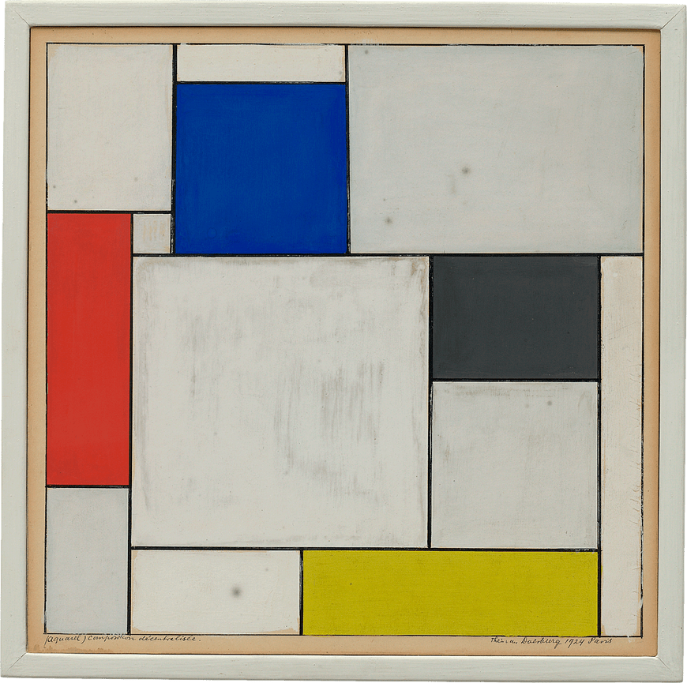

Marcia Heydt

April 15, 2019

# What is the difference between padding, margin, and borders?
The border is the line going around the content's boundaries. Padding puts space between the content and the border. The margin is the space between elements.

# Embed the image of the artwork you used as inspiration.

# Free Response: Summarize your work cycle for this assignment. 
* Started by researching the art on the provided links
* Picked a piece of art
* Created the assignment files
* Created the canvas and determined its size
* Picked the color and created the css
* Created the inner border
* Iterated placing a rectangle in the inner boarder, picking its position, size and color
* Repeated for all rectangles